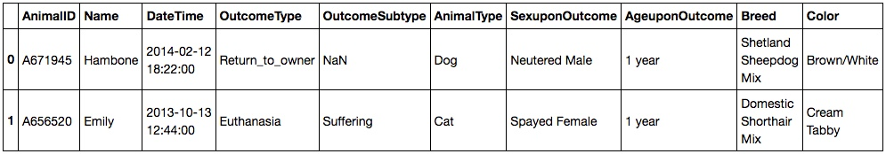
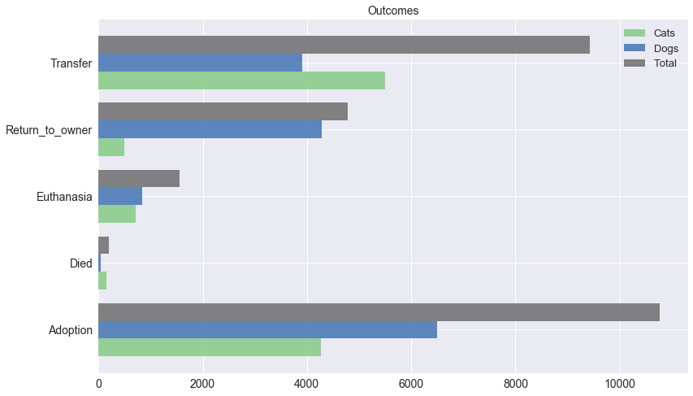
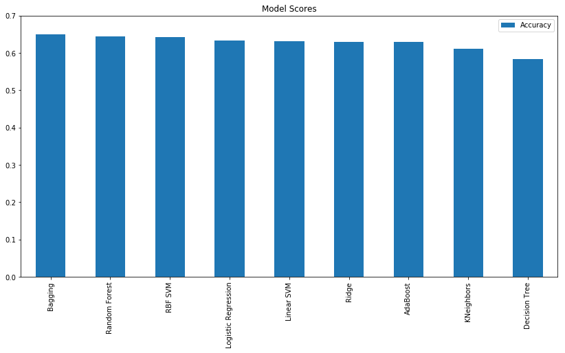
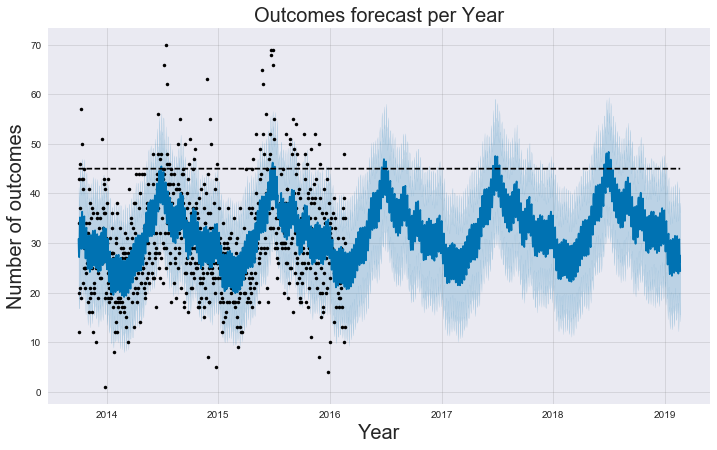

# Machine Learning Engineer Nanodegree - Capstone Project

### [Miguel Ángel Nieto](http://miguelangelnieto.net/)
Wednesday, 1st March 2017

## I. Definition

### Project Overview
__Every year there are around 3.9 million dogs and 3.4 million cats that enter shelters__. That number take a new significance with the percentage of euthanized, 26% of dogs and 41% of cats. Those are national estimates only for the US, but the problem happens worldwide.

Shelters are most of the time at full capacity and still the number of animals that are under their protection is a tiny fraction of the ones that live on the streets. Only taking cats in account, it is estimated that there are __more than 70 million abandoned in the US__. Companion animals without food or clean water resources, no access to vaccines and not spayed, just making the problem to grow exponentially. To understand the difficulty for these animals to survive, we only need to compare the life expectancy. 4 years on the streets, 16 in a house.

Statistics from: [aspca](http://www.aspca.org/animal-homelessness/shelter-intake-and-surrender/pet-statistics)

### Problem Statement
There are some animals that get adopted in days. Some others need months or are never adopted. There are different reasons, like age, color or breed that make some of them more prone to adoption. In the other hand, those with problems would need extra work and attention in order to give them a better life.

An animal could be categorized as "in danger", based on those parameters and possible others. That would help to automate the process so people working in the shelter can focus their energy on them to increase the chances of being adopted. For example, with more social media publications, better spot on the shelter, more advertising in local neighbourhood.

This is a classification problem, where based on some input data it should be possible to predict to which category it belongs. To solve this problem there are different Machine Learning techniques that can help in that task. There is already data correctly classified that can be used to train the Machine Learning model. Therefore, the strategy to solve the problem is to test and find a Supervised Machine Learning model that can find patterns on the data so it can correctly classify new data never seen before.

After training the model, the shelter workers will be able to use it to feed data from new animals that enters it and have a very accurate prediction of what could be the outcome. Some of those outcomes, like __"died" or "euthanized"__ can be used to prioritize some animals over others, to avoid them from happening. Making shelter's workers job easier and providing better chances of survival for those animals in risk. These are the steps:

- Analyze and clean the data
- Prepare the data for Machine Learning use
- Benchmark different models and choose the one that works best as baseline
- Tune its parameters to get the best possible prediction

### Metrics
To measure if the model works as expected, accuracy will be used as a metric. The general term __"accuracy"__ describes the closeness of a measurement to the true value. The model will check the results of all predictions, compare them with real outcomes, and calculate how close we are from 100% success.

For example. Shelter's workers fit the Machine Learning model with 200 new animal information. The model predicts the possible outcomes and some time later we see that 150 were correct. The accuracy in this case would be 75%.

150/200 * 100 = 75

There are other metrics but not really useful for this project.

__R2__: it is used as a score to measure the performance of regression problems, but in this particular case the project is about solving a classification one.

http://scikit-learn.org/stable/modules/generated/sklearn.metrics.r2_score.html

__Precission and Recal__: these metrics are often used for binary classification with possitive and negative outcomes. The idea is to reduce false positives or to correctly classify all positive ones. It is a common metric used for example in medical diagnosis classification. In this particular shelter problem the idea is to correctly classify the outcomes of the animals. There are no particular false positives or false negatives to take in account.

http://scikit-learn.org/stable/modules/model_evaluation.html#precision-recall-and-f-measures

## II. Analysis

### Data Exploration

The original data has 7 columns and 26729 rows. Each row represent a different animal and each column a feature. These are first two lines as example:

 

This is a brief summary of each column. More in depth exploration and graph representations can be found on __1 - Data Exploration and Visualization.html__:

#### __AnimalID__ ####

___Description:___ a unique identifier for each animal that enters the shelter and won't be reused.

___Problem:___ this is a value used by Shelter's application. It provides no useful information for our project.

#### __Name__ ####

___Description:___ name of the animal. _Bella_, _Max_ and _Charlie_ are the ___top 3 dog names___ while _Oliver_, _Max_ and _Bella_ are the ___cat's top three___. Cats is the animal type that most usually has no name assigned. 5019 cats without name in the dataset. 2672 are the number of dogs without name.

___Problem:___ ___There are 7691 animals without name___ and a small group of 21 animals with name "X" that could also be included in that group.

#### __DateTime__ ####

___Description:___ the date when the animal's outcome happened. The first entry is from 1st November 2013 and last one from 21st February 2016. Data Analysis shows that __there is an increase of outcomes in summer months (June, July and August)__, being July the top peak month of the year. __Weekends (Saturday and Sunday) are the peak days of the week__.

___Problem:___ the information stored is __a string combination of date and hour__ that makes data analysis complex and will be not suitable for the machine learning model.

#### __OutcomeType__ ####

___Description:___: this is the outcome we want to predict. There are five different possibilities. __Adoption, Transfer, Return_to_owner, Euthanasia and Died__. Adoption is the most usual outcome. 41% of dogs and 38% of cats are adopted. For all other outcomes (transfer, euthanasia and died) cats have higher ratio, showing that they have less chances for a positive resolution.

___Problem:___ it stores strings, that would need to be converted to integers.

#### __OutcomeSubtype__####  

___Description:___: it contains the subtype of the principal outcome from previous column. An interesting statistic shows that __"Aggressive" is the second most common subtype__ of "Euthanasia", being __99% dogs and 1% cats__ in that subcategory.

___Problem:___ it is the column with more missing values, because 100% of Return_to_owner and 81% of Adoption outcomes have no subtypes registered. There is also a direct relationship between the subtype and the principal outcome. Using this feature could lead to cheating.

#### __AnimalType__:####  

___Description:___ there are __two types of animals, dogs and cats__. The dataset includes __15595 dogs__ and __11134 cats__.

___Problem:___ it stores strings that would need to be converted to integers.

#### __SexuponOutcome__####  

___Description:___ sex of the animal when the outcome happened with 5 different possibilities. __Intact Female, Intact Male, Neutered Male, Spayed Female and Unknown__. Neutered and Spayed are the most usual sex categories. Not neutered/spayed cats is a pretty common problem worldwide and the statistics calculated from the datasets confirms the fact. __4041 cats are Male/Female Intact, 36% of total number of cats. 19% of dogs are Intact.__ This is a big problem, taking in account that __a female cat living outside by its own can have up to 15 kittens per year.__

___Problem:___ there is one missing value.

#### __AgeuponOutcome__:####

___Description:___ age the animal had when the outcome happened. The most common age is 1 year old. The data stored is a combination of numbers and strings like for example "1 year, 2 months, 1 month".

___Problem:___ the data stored is a combination of numbers and strings like for example "1 year, 2 months, 1 month". There are 18 missing values.

#### __Breed__:####

___Description:___ breed of the animal. The most common dog breed is __Chihuahua__ and __Domestic__ for cats.

___Problem:___ it is a string with principal breed and mixes. Too many combinations.

#### __Color__: ####

___Description:___ black is the most common color for both cats and dogs.

___Problem:___ as with breed, there is a major color and a subtype of it. Many combinations to describe the same thing and wrong datatype.

It is clear that there are some problems that affect all the columns:

- __Data type transformation__. Most of the Machine Learning models need numbers as inputs but all the features in the dataset contain strings.
- __Outcome, Animal Type, Sex, Age, Breed and Colour are categorical variables__ so extra transformation (one-hot) could be needed.

### Exploratory Visualization

The outcome is the variable the model need to predict, so it is important to understand how it is distributed.

Following horizontal stacked bar graph allows the reader to easily understand important details:

- What are the most usual outcomes and how they compare to each other.
- For each outcome, number of dogs and cats.

It is possible to see, for example, that the most common outcome is "adoption". In the case of each animal type, dog's most common outcome is "adoption" too but it is "transfer" in the case of cats.

 

### Algorithms and Techniques

This is a classification problem. There are many different models to do the classification with different strengths and weaknesses.  To avoid limiting the problem to a single model, different classification methods are tested and compared using their default parameters:

__Single Classifiers:__

- Decision Trees: http://scikit-learn.org/stable/modules/tree.html

This model build a tree-like graph by learning simple decision rules from the data. One of the problems is that it tends to overfit, creating a complex tree that perfectly fits the training data but failing to generalize. Some of the positive aspects is that it doesn't require most of the data preprocessing like data standardization, the final graph is easy to visualize and it is a fast model to learn.

- Linear SVM: http://scikit-learn.org/stable/modules/svm.html

It tries to find a line that separates the data by trying to maximize the margin between the line and the data points. This model only works if the data is linearly separable.

- RFB SVM: http://scikit-learn.org/stable/modules/svm.html

Similar to the previous model, but instead of a simple line it can use more complex shapes to separate the data, still maximizing the margin between the boundaries of the shape and the data points.

- KNearestNeighbors: http://scikit-learn.org/stable/modules/neighbors.html#classification

It is a non-parametric model. That means that there is no learning process making model fit very fast. It works by searching for the K nearest neighbors to a new particular data point, then choose a prediction by majority vote. Its main weakness is the performance when there are many data points or features.

- Logistic Regression: http://scikit-learn.org/stable/modules/linear_model.html#logistic-regression

In spite of its name is a classification model and not a regression one. It separates the data with a line by using a logistic function like a sigmoid.

- Ridge: http://scikit-learn.org/stable/modules/generated/sklearn.linear_model.RidgeClassifier.html

It is a model similar to logistic regression (a line that separates data) but imposing a penalty to avoid overfitting and making it robust to outliers.

__Ensemble with Decision Tree as base estimator:__

The following three models work in a similar way with small differences.

Using decision trees with these ensemble methods helps to alleviate some of the problems listed before, like overfitting. The main advantage, a part from reducing the variance, is that the final classification model gives better results than the base estimator alone. The main problem is the time to train the model, since it will have to run hundreds or thousand of decision trees.

- Random Forest: http://scikit-learn.org/stable/modules/ensemble.html#forest

The base estimator is run several times (configurable by a parameter) to find a better model averaging their predictions.

- Bagging: http://scikit-learn.org/stable/modules/ensemble.html#bagging-meta-estimator

Similar to Random Forest, but running each base estimator on random subsets of the original training set.

- AdaBoost: http://scikit-learn.org/stable/modules/ensemble.html#adaboost

This model, instead of averaging the results of each base estimator, uses a different method. It runs each estimator sequentially to finally combine all predictions using a weighted majority vote.

The one that gets best accuracy will be chosen as final model.

### Benchmark
- A person choosing randomly would predict the outcome 20% of the time.
- A person choosing always "Adopted" would predict the outcome 40% of the time.

The idea behind this benchmark is that the Machine Learning model should be better, in terms of accuracy, than a human. The final goal is to provide an automatic way to predict the outcome of new animals and save time from the workers on that task. If the model is not better in accuracy than a person always predicting "Adopted" or randomly choosing one outcome, then the model won't be useful and won't provide any positive benefit to the overall process.

## III. Methodology

### Data Preprocessing

During the first step I am going to benchmark different classification models. Each model has different requirements. To make all them compatible with the dataset I am going to apply data preprocessing to all features even if some models don't really require them (for example Decision Trees). This is not going to be a problem because unneeded preprocess doesn't affect the result.

These are the different preprocessing techniques used:

- Drop columns not needed anymore.
- Fill missing values.
- Change strings to integers.
- Data standardization so all numerical values have 0 mean and 1 standard deviation.
- One Hot Enconding of categorical columns if it has less than 10 different values (to avoid curse of dimensionality).

Each column will have one or more combinations of each transformation listed above.

__AnimalID__: removed, it is a unique ID used by Shelter's application.

__Name__: NaNs changed with "NoName" string. Then, each name changed to an integer value and finally standardized.

__DateTime__: separated in different columns. Year, Month, DayoftheWeek and Hour. For the first 3 One Hot Encoding is applied and for the last one only standardization. Then, original Datetime  column removed.

__OutcomeType__: stored on its own variable "labels". Then converted to integers. After that, removed the column from the training variable.

__OutcomeSubtype__: it can leak information about the outcome, so removed.

__AnimalType__: one hot encoded. Then original column removed.

__SexuponOutcome__: there is one NaN. The name and age reveals it is a dog, male and 7 years old. Therefore, the NaN changed with the most possible Sex, "Neutered Male". Then one hot encoded and original column removed.

__AgeuponOutcome__: missing values changed to the most common value, "1 years". Then the values modified to the number of days, instead of strings like "1 year", "7 Months", "4 years". After that, standardization.

__Breed__: new column created that only contains the major breed. For example, for "Domestic Shorthair Mix" it stores "Domestic". Then, old column removed.

__Color__: new column created that only contains the major color. For example, for "Cream Tabby" it stores "Cream". Then, old column removed.

After all the changes, the dataset contains 35 columns and no NaNs. All values are integers and standardized.

### Implementation

Some models, usually those based on Decision Trees, have __overfitting problems__. They memorize the dataset and then have problems to generalize and predict based on values not seen before.

To avoid the problem, K-Folds cross-validator is used during the models benchmark. It splits the dataset into k (5 in this case) consecutive folds. Then k - 1 folds are used for training and the remaining for validation. After repeating the process 5 times, an __average accuracy is returned__.

Benchmarking models require very similar code so a function is really helpful. __lets_try()__ runs cross-validation with each model, stores the average accuracy and returns a summary and a bar graph.

### Refinement

The previous benchmark shows that Bagging is the model that provides the best accuracy using default parameters, 64%. Bagging is a meta-estimator that runs base estimators (decision trees by default) on random subsets of the data and then aggregate the results.
In summary, they use a combination of weak learners to improve the final result.

To optimize the model GridSearchCV is used to test different number of base estimators, with values 50, 100, 150, 200, 250 and 300. GridSearchCV will run Bagging model, training and testing it with each of the possible parameters to finally return the one that gives better accuracy.

After the test, 250 provides the best result, 67% accuracy. An increase of 3% over the base non-refined model.

## IV. Results

### Model Evaluation and Validation

Using k-fold allow to not touch the test dataset during model selection, so there is no possibility of leaking information to the model. Data stored there won't be seen until the final test is run. Therefore, __the results from the test can be trusted since there has been no leak from testing dataset__. Same precaution was taken during hyperparmeters benchmark.

Running the final model on that test dataset gives an accuracy of 67%. To validate the result the same model is used but providing different input data. The original data is split randomly 10 times in training/test datasets. Each dataset contain different combination of rows. The results show an accuracy between 66% and 68% on all three tests. __The model is robust enough, producing very similar results with small variations.__

__The final model provides a good solution to the original problem.__ It is able to correctly classify data never seen before with greater accuracy than a human.

### Justification

This accuracy is better than the original benchmark, a person choosing randomly or choosing always "Adopted". Therefore, the final model is better and faster than predicting the outcome.

## V. Conclusion

### Free-Form Visualization

We can predict the outcome with >67% of accuracy. This will help to save some time to shelter workers. There is still a second important aspect, __predict future growth__.

The data we have covers from November 2013 to February 2016. That data is used in the following graph to predict what will happen in the future. It shows the forecast of outcomes per year.

The reader can find that the year peak is on summer months. The forecast shows it will steadily increase every year by a small amount. This information can be used to plan the shelter's capacity with enough time in advance.

 

### Reflection

# Some discussion about the challenges and interesting aspects of the project need to be mentioned as well

The project started with data analysis of each feature present in the data set along with visualizations. This process helped to get intuition about what features could help in determining the correct outcome of each animal.

All the columns had string data type so the base dataset was not good enough for this task. Most of the time was spent on checking each column, the values stored and performing conversion to a data type that allowed working with it.

After the conversion, all the column were storing integers. Data preprocess before model benchmarking also involved more changes. Standardization and one-hot encoding of some of the categorical variables.

This process involved more time and work done using "pandas" than what I expected initially. Pandas is still a data manipulation library that I am learning to use, so it took most of the project effort. Depending on the data, sometimes cleaning/analyzing require more time that the Machine Learning model preparation.

Once the data was analyzed and prepossessed, different classification models were tested with their default parameters. The one with better prediction accuracy was then benchmarked with cross validation to find the best performing parameters.

The simple idea of using weak learners like decision trees to create a more complex mode works better than I expected. Top two models are Ensemble Classifiers that use several Decision Tree under the hood. Ironically, Decision Tree alone is the one that yields the worst performance.

Finally, to double check the result, 10 prediction test were run on different random combinations of training/test datasets taken from the original data.

### Improvement

There are still some categorical variables that could be converted using one-hot encoding. The problem is that those like "colors" or "breed" have many different values and could lead to a really large number of features. Since we don't have many rows, it is better to leave those untouched to avoid [curse of dimensionality](https://en.wikipedia.org/wiki/Curse_of_dimensionality) problems. If I had more data, then would be possible to apply the conversion to all features.

The final result shows that Ensemble classification models perform better in these kind of problems. Using xgboost could probably increase the accuracy a bit more, since it tends to give better results on most of the kaggle competitions similar to this one.
